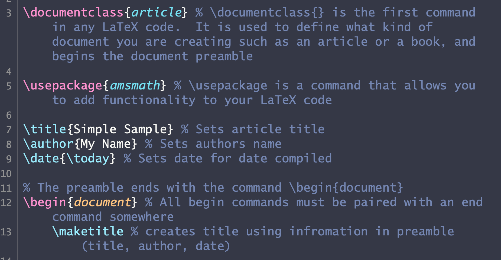

# Dracula for [Textastic](https://textasticapp.com)

> A dark theme for [Textastic](https://textasticapp.com).

## Install

All instructions can be found at [draculatheme.com/textastic](https://draculatheme.com/textastic).

## Team

This theme is maintained by the following person(s) and a bunch of [awesome contributors](https://github.com/dracula/template/graphs/contributors).

 |  |
--- | --- | 
[Keiran Harcombe](https://github.com/kjharcombe) | [Zeno Rocha](https://github.com/zenorocha) | 

## License

[MIT License](./LICENSE)
